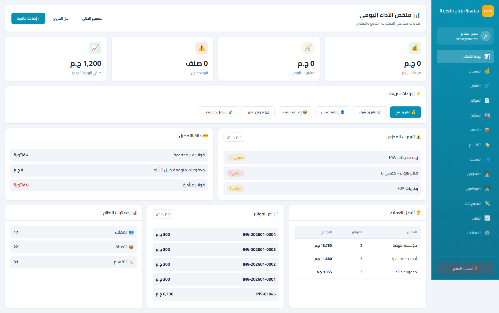

# CRM System

A comprehensive Customer Relationship Management (CRM) system built with Laravel 12, featuring full Arabic RTL support, invoice management, inventory tracking, and financial reporting.

## 📸 Portfolio & Screenshots

**[View Interactive Gallery](gallery/index.html)** | **[Video Walkthrough](gallery/crm-walkthrough.webm)** | **[Complete Portfolio Guide](gallery/PORTFOLIO.md)**

Explore our comprehensive visual documentation:
- 76 professional screenshots across 4 viewport sizes (Desktop, Laptop, Tablet, Mobile)
- Full HD video walkthrough (~70 seconds)
- AI-enhanced descriptions powered by Google Gemini
- Interactive gallery with responsive filtering

### Quick Preview

<p align="center">
  
</p>

## ✨ Features

### Core Modules
- 📋 **Invoice Management** - Create, edit, and track invoices with print view
- 🛒 **Purchase Orders** - Complete purchase order processing and management
- 👥 **Employee Management** - Staff tracking and management
- 👤 **Customer Relations** - Comprehensive customer database
- 📦 **Product Catalog** - Product inventory and categorization
- 🏢 **Supplier Management** - Supplier tracking and relationships
- 🏭 **Warehouse Inventory** - Multi-warehouse inventory control
- 💰 **Sales Tracking** - Sales monitoring and analytics
- 💸 **Expense Management** - Track and categorize expenses

### Sales Representative System
- 👤 **Sales Rep Dashboard** - Personal dashboard for each sales rep
- 🔒 **Data Isolation** - Sales reps see only their own customers, sales, and collections
- 🏪 **Multi-Warehouse Assignment** - Assign sales reps to multiple warehouses
- 💰 **Payment Collection** - Sales reps can collect payments from customers
- 📊 **Performance Reports** - Admin can view all sales reps' performance

### Payment Methods
- 💵 Cash payments
- 🏦 Bank transfers
- 📱 **InstaPay** - Modern digital payment
- 📲 **Vodafone Cash** - Mobile wallet payments
- 📝 Check payments
- 💳 Card payments

### Advanced Features
- 🔍 Search & Filter on all pages
- 📊 Real-time dashboard statistics
- 💳 Payment status tracking (paid, pending, overdue)
- 📈 Financial reports & analytics
- ⚙️ System settings and configuration
- 🎛️ **Feature Management** - Enable/disable system features
- 🌍 Arabic RTL interface
- 📱 Fully responsive design
- 🎨 Modern UI with Tailwind CSS
- 🔐 Secure authentication system

## 🚀 Technology Stack

- **Framework:** Laravel 12
- **PHP:** 8.2
- **Database:** SQLite
- **Frontend:** Vite, Alpine.js, Tailwind CSS
- **Automation:** Playwright for testing and documentation
- **AI Enhancement:** Google Gemini for screenshot analysis

## 📦 Installation

```bash
# Clone the repository
git clone https://github.com/Mostafa1712002/new-crm.git
cd new-crm

# Install dependencies
composer install
npm install

# Configure environment
cp .env.example .env
php artisan key:generate

# Run migrations
php artisan migrate --seed

# Build assets
npm run build

# Start development server
php artisan serve
```

## 🎯 Usage

### Default Login Credentials
- **Email:** admin@admin.com
- **Password:** password

### Generate Portfolio Documentation

```bash
# Generate all screenshots
npm run gallery

# Create video walkthrough
npm run video

# AI enhancement with Gemini
npm run enhance

# Complete portfolio generation
npm run gallery:full
```

## 📊 Statistics

- **Total Pages:** 19
- **Screenshots:** 76 (4 viewport sizes)
- **Video Duration:** ~70 seconds
- **Code Files:** 246
- **Lines of Code:** 33,800+

## 🌐 Platform Support

- ✅ Desktop (Windows, Mac, Linux)
- ✅ Tablet (iPad, Android)
- ✅ Mobile (iOS, Android)
- ✅ All Modern Browsers

## 📖 Documentation

- [Gallery Portfolio Guide](gallery/PORTFOLIO.md) - Complete gallery documentation
- [Video Information](gallery/VIDEO_INFO.md) - Video walkthrough details
- [AI Analysis](gallery/AI_ANALYSIS.md) - Gemini AI insights
- [Quick Start](gallery/README.md) - Gallery quick start guide

## 🤝 Contributing

Contributions are welcome! Please feel free to submit a Pull Request.

## 📄 License

This project is open-sourced software licensed under the [MIT license](https://opensource.org/licenses/MIT).

## 👨‍💻 Author

**Mostafa**
- GitHub: [@Mostafa1712002](https://github.com/Mostafa1712002)

---

Built with ❤️ using Laravel
